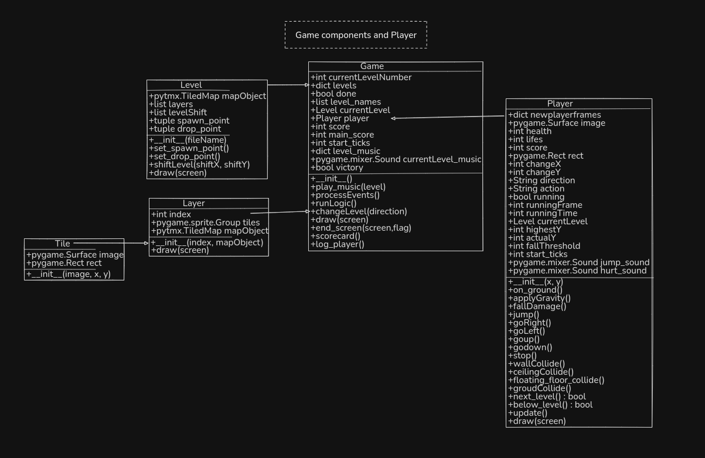

# Jump-Hero
Final assessment for the Advanced Programming Subject 

## Installation

1. Clone this repository
2. Install the required packages:
``` pip install -r requirements.txt```

## How to Play

Run the main game file: 

``` python game.py```

### Controls

- Left Arrow: Move left
- Right Arrow: Move right
- Space: Jump

### Objective

Climb as high as you can! The game rewards vertical progress.

### God Mode

If you find the game too challenging, you can enable God Mode by setting `god_mode = True` in the settings file. In God Mode:
- Gravity is disabled
- The player takes no damage

## Class Digram 



## Assets

### Audio
All game audio was sourced from [QuickSounds](https://quicksounds.com/).

### Tilesets and Sprites
The game uses assets from the following sources:
1. [Kings and Pigs](https://pixelfrog-assets.itch.io/kings-and-pigs)
2. [Free Tiny Hero Sprites Pixel Art](https://free-game-assets.itch.io/free-tiny-hero-sprites-pixel-art)
3. [Multi-size Mythical Dungeon Tileset](https://tilation.itch.io/multi-size-mythical-dungeon-tileset)
4. [Hooded Protagonist](https://penzilla.itch.io/hooded-protagonist)
5. [Sci-Fi Lab Tileset](https://foozlecc.itch.io/sci-fi-lab-tileset-decor-traps)


## Screenshots


## References

### Libraries and Frameworks
- Pygame
- Pytmx

### Large Language Models
- Claude (Anthropic)
- ChatGPT (OpenAI)

### Inspirations
- [Pygame Tiled Demo](https://github.com/katmfoo/pygame-tiled-demo)
- [Pygame Tutorial Video](https://youtu.be/AY9MnQ4x3zk?si=id02AdiEujKSoqsI)

## Note from the Vish

> "This game is designed to have fun take it easy and chill"
